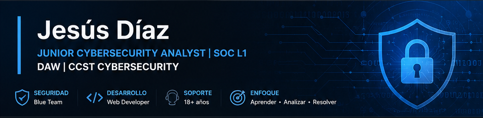

  

# 👋 Hola, soy Jesús Díaz

### Junior Cybersecurity Analyst | SOC L1 | Técnico Superior en Desarrollo de Aplicaciones Web

Profesional en transición hacia el sector IT con más de **18 años de experiencia** en soporte técnico, atención al cliente, backoffice y resolución de incidencias.

---

## 🛡️ Certificaciones y formación

| Certificación | Estado |
|---|---|
| Cisco CCST Cybersecurity | ✅ Completado |
| Google Cybersecurity Professional Certificate | ✅ Completado |
| CFGS Desarrollo de Aplicaciones Web | ✅ Finalizado |
| Bootcamp Ciberseguridad Ofensiva | ✅ Finalizado |

---

## 💻 Tecnologías

### Ciberseguridad

### Desarrollo

---

## 📂 Repositorios destacados

| Proyecto | Descripción |
|---|---|
| [SOC-L1-Labs](https://github.com/Jediex69/SOC-L1-labs) | Laboratorios orientados a SOC L1, análisis de logs, tráfico de red y automatización. |
| [Ciberseguridad_y_hacking_etico](https://github.com/Jediex69/Ciberseguridad_y_hacking_etico) | CTFs, auditorías, informes técnicos y laboratorios de seguridad. |
| [Proyectos_DAW](https://github.com/Jediex69/Proyectos_DAW) | Proyectos desarrollados durante el CFGS DAW. |
| [Proyectos_React](https://github.com/Jediex69/Proyectos_React) | Aplicaciones React para practicar frontend moderno. |

---

## 🌱 Actualmente

- 📚 Preparando **CompTIA Security+**
- 🐍 Profundizando en **Python para automatización**
- 🛡️ Construyendo laboratorios orientados a **SOC L1**
- 🚀 Buscando oportunidades en **ciberseguridad junior / soporte IT**

---

## 🎯 Objetivos 2026

✅ CCST Cybersecurity
✅ DAW finalizado
🔄 Preparando CompTIA Security+
🔄 Construyendo SOC-L1 Labs
🔄 Automatización con Python
🎯 Primer puesto como SOC L1

---

## 📫 Contacto

- 💼 LinkedIn: https://www.linkedin.com/in/jesus-diaz-exposito
- 🌐 Portfolio: https://jediex69.github.io
- 📧 Email: jediex69@gmail.com

---

> *"La tecnología cambia constantemente. Aprender de forma continua también forma parte del trabajo."*
